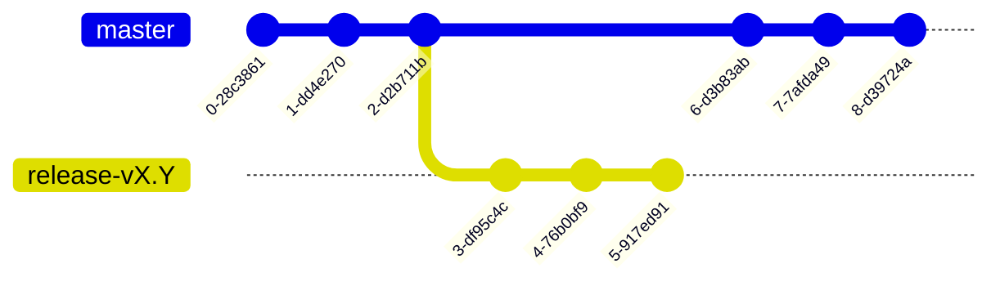
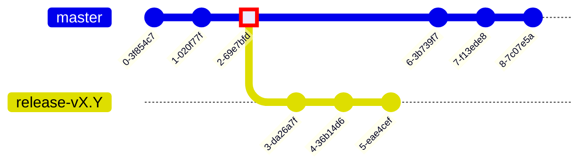

# operator-cloud

A fork of tigera/operator which is run in the Management clusters of Calico Cloud.

## Branch Structure

operator-cloud follows the same branch structure as the upstream tigera/operator repo, where a release branch is cut for each release.



All operator-cloud release branches will match the upstream release branch of the same name. No additional release branches are cut which do not have a matching upstream branch.

## Contributing

Submit changes to the `master` branch. Once merged, cherry-pick your changes to the most recent release branch.

## Branch Maintenance

This information is for maintainers to keep branches up to date with upstream changes.

The following instructions assume:

- You have the `tigera/operator-cloud` repository checked out locally
- You have a remote `origin` which tracks `tigera/operator-cloud`
- You have a remote `upstream` which tracks `tigera/operator`
- You've fetched all remotes **and fetch again each time your changes are merged on origin**.

Also consider enabling git rerere:

```
git config rerere.enabled true
```

This allows git to learn how you resolve conflicts and reapply it. If you mess up and need to start again, you won't have to resolve the same commits a second time.

### Pulling updates to master & creating release branches

It's important we don't pull past an upstream branch point, otherwise when we cut a release branch, we'll potentially include commits which upstream doesn't include in their release branch, causing merge conflicts.



1. Determine the next release `$BRANCH` you want to pull up to. There is no automated way to do this. 

   First, determine the most recent release branch on origin:

   ```
   git branch -rl origin/release-*
   ```

   Then see if the next minor version has been cut on upstream. If for example you've determined the latest release branch on origin is `release-v1.29`, run the following command with `VERSION=v1.30`:

   ```
   git branch -rl upstream/release-$VERSION
   ```

   If no new release branch has been cut upstream, you may `git merge origin/master`, resolve conflicts, submit the PR, and merge.

   If one has, proceed to the next step.

1. Determine the merge-base of the new release branch and master:

   ```
   git merge-base upstream/master upstream/$BRANCH
   ```

1. Merge the changes, resolve conflicts:

   ```
   git merge $COMMIT
   ```

1. Create PR to master, merge, and then `git fetch origin`.

1. Create a new release branch:

   ```
   git checkout -b $BRANCH origin/master
   ```

1. Push the release branch

   ```
   git push origin $BRANCH
   ```

### Pulling updates to release branches

Before pulling updates from the upstream release branch, consider how far down the branch you want to pull. If you pull from the HEAD of the branch, you make pick up changes without the required matching changes in the components launched by the operator. Review the diff between the latest tag on that branch and the HEAD of that branch to confirm.

1. Checkout the release branch if you haven't already done so. Ensure it is updated to match the release branch on origin.

1. Pull updates from upstream release branch and resolve conflicts:

   ```
   git merge origin/$BRANCH
   ```

1. Create a PR to the release branch, merge, and then `git fetch origin`.
