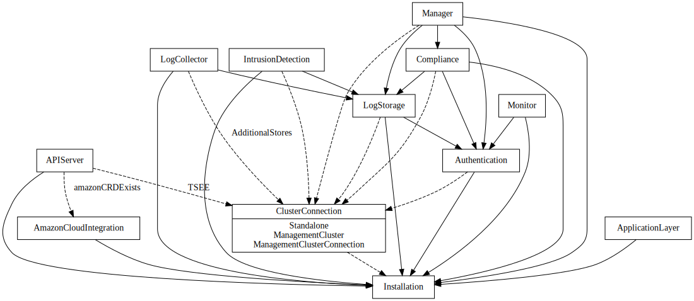

# Calico Operator

[](https://quay.io/repository/tigera/operator)

This repository contains a Kubernetes operator which manages the lifecycle of a Calico or Calico Enterprise installation on Kubernetes or OpenShift. Its goal is
to make installation, upgrades, and ongoing lifecycle management of Calico and Calico Enterprise as simple and reliable as possible.

This operator is built using the [operator-sdk](https://github.com/operator-framework/operator-sdk), so you should be familiar with how that works before getting started.

## Getting Started Running Calico
There are many avenues to get started running Calico depending on your situation.
- Trying out Kubernetes on a single host or on your own hardware? The [quick start guide](https://projectcalico.docs.tigera.io/getting-started/kubernetes/quickstart) will have you up and running in about fifteen minutes.
- Running a managed public cloud? Use our guides for enabling Calico network policies.
  - [Amazon Elastic Kubernetes Service (EKS)](https://docs.tigera.io/calico/latest/getting-started/kubernetes/managed-public-cloud/eks)
  - [Google Kubernetes Engine (GKE)](https://docs.tigera.io/calico/latest/getting-started/kubernetes/managed-public-cloud/gke)
  - [IBM Cloud Kubernetes Service (IKS)](https://docs.tigera.io/calico/latest/getting-started/kubernetes/managed-public-cloud/iks)
  - [Microsoft Azure Kubernetes Service (AKS)](https://docs.tigera.io/calico/latest/getting-started/kubernetes/managed-public-cloud/aks)
- Want to go deeper? Visit [https://docs.tigera.io/](https://docs.tigera.io/) for full documentation.

## Get Started Developing

### Code structure

There are a few important areas to be aware of:

- Operator API definitions exist in `api/v1`
- Rendering code for generating Kubernetes resources is in `pkg/render`
- Control/reconcile loops for each component can be found in `pkg/controller/<component>`
  There is a layer that was introduced with the upgrade to operator-sdk v1.x of controllers in `controller` that currently calls `pkg/controller/<component>`.
- Status reporting is in `pkg/controller/status`

Tests:

- Tests for file `X.go` can be found in `X_test.go`.
- FV tests which run against a local cluster can be found in `test/*.go`.

### Controller Dependency Graph

This graph shows the dependencies between controllers. Optional dependencies are in dashed lines.



### Design principles

When developing in the operator, there are a few design principles to be aware of.

- API changes should be rare occurrences, and the API should contain as little as possible. Use auto-detection
  or automation wherever possible to reduce the API surface.
- Each "component" should receive its own CRD, namespace, controller, and status manager. e.g., compliance, networking, apiserver.
- Controllers interact with each other through the Kubernetes API. For example, by updating status on relevant objects.

### Adding a new CRD

New APIs are added using the `operator-sdk` tool.

```
operator-sdk create api --group=operator --version=v1 --kind=<Kind> --resource
```

When modifying or adding CRDs, you will need to run `make gen-files` to update the auto-generated files. The tool
might change the scope of existing resources to "Namespaced", so make sure to set them back to their desired state.

### Adding a new controller

New controllers are also added using the `operator-sdk` tool.

```
operator-sdk create api --group=operator --version=v1 --kind=<Kind> --controller
```

New controllers will be created in the newer format so it should be considered if it is desirable to keep the
current format that calls to a controller in `pkg/controller` or add the controller only in `controllers`.

### Running it locally

You can create a local k3d cluster with the Makefile:

	make cluster-create

Export the kubeconfig:

	export KUBECONFIG=./kubeconfig.yaml

Create the tigera-operator namespace:

	kubectl create ns tigera-operator

Then, run the operator against the local cluster:

	# enable-leader-election is necessary since you'll be running the operator outside of a cluster
	KUBECONFIG=./kubeconfig.yaml go run ./ --enable-leader-election=false

To launch Calico, install the default custom resource:

	kubectl create -f ./config/samples/operator_v1_installation.yaml

To tear down the cluster:

	make cluster-destroy

#### Running a custom image in your existing Calico (Enterprise) cluster

These steps assume that you already have installed the operator in a Calico (Enterprise) cluster after following either
docs.projectcalico.org or docs.tigera.io. To verify, run `kubectl get deployment -n tigera-operator tigera-operator`.
You should see an existing deployment.
The steps also assume that you have setup your docker such that you can push to a registry.

These are the steps:
1. Make your own code changes to this repository.
2. Create the binaries and a docker image.
   ```bash
   make image
   ```
   The output will show you the docker tag that was just created. (For example: `Successfully tagged tigera/operator:latest-amd64`.)
3. Re-tag the image and push it to a registry of your choice.
   ```
   export IMAGE=myregistry.com/user/tigera/operator:my-tag
   docker tag tigera/operator:latest $IMAGE
   docker push $IMAGE
   ```
4. Change your deployment to use the image.
   ```
   kubectl set image deploy  -n tigera-operator tigera-operator  tigera-operator=$IMAGE
   ```
   _If your image is in a private registry, you also need to add [imagePullSecrets](https://kubernetes.io/docs/concepts/containers/images/) to the deployment._

#### Set breakpoints in Goland IDE and run the code against your existing Calico (Enterprise) cluster

These steps assume that you already have installed the operator in a Calico (Enterprise) cluster after following either
https://docs.projectcalico.org or https://docs.tigera.io. To verify, run `kubectl get deployment -n tigera-operator tigera-operator`.
You should see an existing deployment. Install [kubefwd](kubefwd.com).

1. Scale down the operator, so it does not interfere with your own:
```bash
kubectl scale deploy -n tigera-operator tigera-operator --replicas=0
```
2. Run kubefwd in a separate terminal, so pods and service names are accessible from your local computer.
```bash
kubefwd svc -n calico-system -n tigera-compliance -n tigera-kibana -n tigera-manager -n tigera-dex -n tigera-elasticsearch -n tigera-prometheus -c $KUBECONFIG
```
3. Open a code file in your editor and set a breakpoint.
4. Create a debug configuration by right-clicking main.go and select `modify run configuration`.
   1. Under Run kind, select `Package`
   2. Under Environment, add `KUBECONFIG=/path/to/config`
   3. In Program arguments, add `--enable-leader-election=false`
5. Save the configuration. You can now run it in debug mode.

### Using Calico Enterprise

To install Calico Enterprise instead of Calico, you need to install an image pull secret,
as well as modify the Installation CR.

Create the pull secret in the tigera-operator namespace:

```
kubectl create secret -n tigera-operator generic tigera-pull-secret \
    --from-file=.dockerconfigjson=<PATH/TO/PULL/SECRET> \
    --type=kubernetes.io/dockerconfigjson
```

Then, modify the installation CR (e.g., with `kubectl edit installations`) to include the following:

```
spec:
  variant: TigeraSecureEnterprise
  imagePullSecrets:
  - name: tigera-pull-secret
```

You can then install additional Calico Enterprise components by creating their CRs from within
the `./deploy/crds/` directory.

### Running unit tests

To run all the unit tests, run:

	make test

To run a specific test or set of tests, use the `GINKGO_FOCUS` argument.

	make test GINKGO_FOCUS="component function tests"

### Making temporary changes to components the operator manages

The operator creates and manages resources and will reconcile them to be in the desired state. Due to the
reconciliation it does, if a user makes direct changes to a resource the operator will revert those changes.
To enable the user to make temporary changes, an annotation can be added to any resource directly managed by
the operator which will cause the operator to no longer update the resource.
Adding the following as an annotation to any resource will prevent the operator from making any future updates to the annotated resource:

  *Do not use this unless you are a developer working on the operator. If you add this annotation,
  you must remove it before the operator can manage the resource again.*

  ```
  unsupported.operator.tigera.io/ignore: "true"
  ```

#### Example update to calico-node DaemonSet

Notice that the annotation is added in the top level metadata (not in the spec.template.metadata).
(note the below is not a valid manifest but just an example)
```
kind: DaemonSet
apiVersion: apps/v1
metadata:
  name: calico-node
  namespace: calico-system
  labels:
    k8s-app: calico-node
  annotations:
    # You should NOT use this unless you want to block the operator from doing its job managing this resource.
    unsupported.operator.tigera.io/ignore: "true"
spec:
  template:
    metadata:
      labels:
        k8s-app: calico-node
      annotations:
        scheduler.alpha.kubernetes.io/critical-pod: ''
    spec:
      containers:
        - name: calico-node
          image: calico/node:my-special-tag
```
