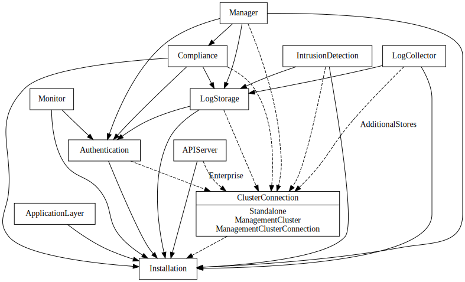

# Developing code in tigera/operator

## Design principles

When developing in the operator, there are a few design principles to be aware of.

- API changes should be rare occurrences, and the API should contain as little as possible. Use auto-detection or automation wherever possible to reduce the API surface.
- Each "component" should receive its own CRD, namespace, controller, and status manager. e.g., compliance, networking, apiserver.
- Controllers interact with each other through the Kubernetes API. For example, by updating status on relevant objects.

### Use of Namespaces

When deploying microservices on Kubernetes, Namespaces can be a powerful tool. We have an established pattern of deploying each distinct service / subsystem of Calico in its own namespace. There are a number of benefits to doing so. Here is a potentially non-exhaustive list.

- Less error prone in a number of ways
    - Easier to write proper network policy. e.g. harder to accidentally select an unintended pod
    - Easier to limit API server access using RBAC and easily prevent components from accessing Secrets and other resources that they do not need access to.
    - Easier to delete subsystems and associated resources (e.g., all secrets associated with compliance, when disabling it)
    - Easier to enable access to a subset of pods when needed - e.g., user X needs temporary access to calico/node to debug an issue, but shouldn’t need access to every other Calico pod.
- Namespaces provide a scope for names, allowing us to reuse names where appropriate.
    - No need to write complex naming / labeling conventions.
- We use namespaces in the operator to keep a “master copy” or “backup” of some configuration, which is then replicated to component namespaces as needed.
- Some useful Kubernetes guardrails are per-namespace:
    - PodSecurityStandards. We use several of these based on components to provide least-privilege where possible.
    - ResourceQuota: We don’t currently use this, but it would allow us or a customer to limit resources to a particular sub-system based on namespace if desired in the future.
- Namespaces are used in Kubernetes’ automatically generated DNS records for services.
- Namespaces allow for more performant API queries (we don’t really use this particular feature of namespaces heavily, but we could).

This all results in:

- Fewer bugs being written into the code
- Fewer potential security issues
- Easier to troubleshoot clusters
- Faster development cycle

## Code guidelines

### Code structure

There are a few important packages to be aware of:

- Operator API definitions exist in `api/v1`
- Rendering code for generating Kubernetes resources is in `pkg/render`
- Control/reconcile loops for each component can be found in `pkg/controller/<component>`
- Status reporting is in `pkg/controller/status`

Tests:

- Tests for file `X.go` can be found in `X_test.go`.
- FV tests which run against a local cluster can be found in `test/*.go`.

### Certificates and secrets

Many of the certificates the operator uses get stored as secrets and will be defaulted and created by the operator if not provided by the user. These secrets, when provided by the user, should not be “claimed” with OwnerReferences, so they must not be rendered (they may be copied to other namespaces with an OwnerReference though). Secrets created by the operator should be created in the controller package and rendered with the Passthrough component to ensure they have an OwnerReference.

All secrets constant names should use the following suffix naming convention:

- PrivateCertSecret: for secrets with a certificate and private key that must not be provided by the user (operator-managed secrets).
- CustomizablePrivateCertSecret: for secrets with a certificate and private key that may be provided by the user
- CertSecret: secrets that contain a certificate but no private key

### API code

- APIs should adhere to the [Kubernetes API conventions](https://github.com/kubernetes/community/blob/master/contributors/devel/sig-architecture/api-conventions.md)
- When changing an API, make changes to [pkg/controller/migration/convert][convert] if new configuration can be handled when migrating from a manifest-based Calico OSS install to the operator.
- Prefer the projectcalico.org/v3 API group over the crd.projectcalico.org/v1 API group wherever possible. The CRD API should be used only when the Calico apiserver is not available.

### Status reporting

The `TigeraStatus` API is intended to provider user-facing, and user-actionable feedback. It is not primarily a debugging tool for developers, and debug level information should instead go into log output. When writing new `TigeraStatus` output, take care to ensure the output is accessible for an audience that is not familiar with the inner workings of the operator code.

- Use concise language.
- Include precise object names and namespaces (e.g., "Waiting for tigera-operator/user-credentials to exist" instead of "Waiting for user credentials")
- Where possible, include suggested user actions.

### Controller Dependency Graph

This graph shows the dependencies between controllers. Optional dependencies are in dashed lines.

### Cherry-picks

When picking changes to a release branch, you must cherry-pick the change to all release branches semantically after the target release as well. This ensures that if a user upgrades their cluster, they do not "lose" features that existed in a prior release.

## Common tasks

See [common tasks](common_tasks.md) for detailed information on common dev procedures like running the code, tests, and debugging.

[convert]: https://github.com/tigera/operator/tree/master/pkg/controller/migration/convert
