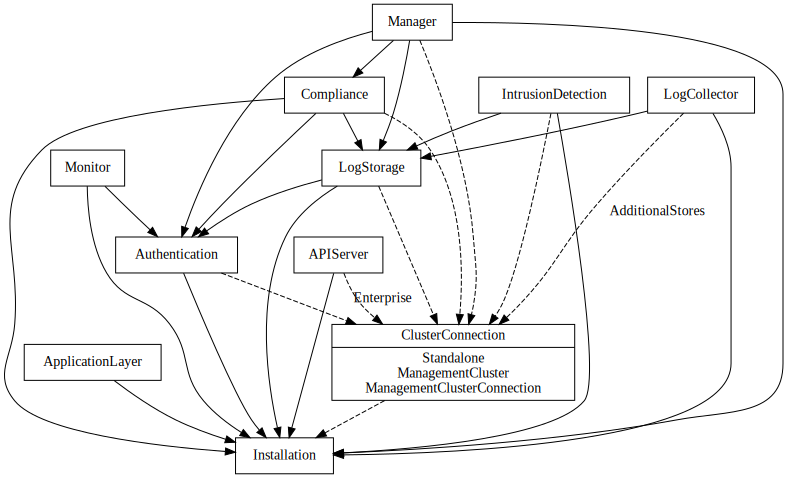

# Developer Guidelines

Workflow, tooling, and day-to-day development procedures for tigera/operator. For code architecture and design principles, see [principles.md](principles.md).

## Code structure

There are a few important packages to be aware of:

- Operator API definitions exist in `api/v1`
- Rendering code for generating Kubernetes resources is in `pkg/render`
- Control/reconcile loops for each component can be found in `pkg/controller/<component>`
- Status reporting is in `pkg/controller/status`

Tests:

- Tests for file `X.go` can be found in `X_test.go`.
- FV tests which run against a local cluster can be found in `test/*.go`.

## API code

- APIs should adhere to the [Kubernetes API conventions](https://github.com/kubernetes/community/blob/master/contributors/devel/sig-architecture/api-conventions.md)
- When changing an API, make changes to [pkg/controller/migration/convert][convert] if new configuration can be handled when migrating from a manifest-based Calico OSS install to the operator.

## Code generation

- Always run `make gen-files` after API or CRD changes. This regenerates CRD manifests, deepcopy methods, and client sets.
- Don't edit generated files by hand. Files in `pkg/components/` and `pkg/imports/crds/` are regenerated by make targets. Edit the source configs instead.
- After running `gen-files`, verify that existing resources weren't inadvertently changed to "Namespaced".

## Controller dependency graph

This graph shows the dependencies between controllers. Optional dependencies are in dashed lines.

## Cherry-picks

When picking changes to a release branch, you must cherry-pick the change to all release branches semantically after the target release as well. This ensures that if a user upgrades their cluster, they do not "lose" features that existed in a prior release.

## Common tasks

See [common tasks](common_tasks.md) for detailed information on common dev procedures like running the code, tests, and debugging.

[convert]: https://github.com/tigera/operator/tree/master/pkg/controller/migration/convert
